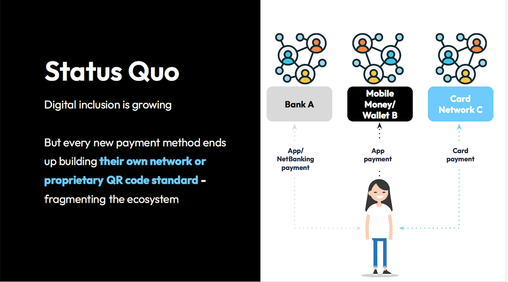
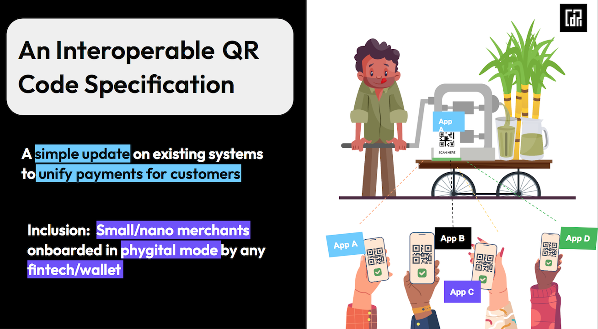
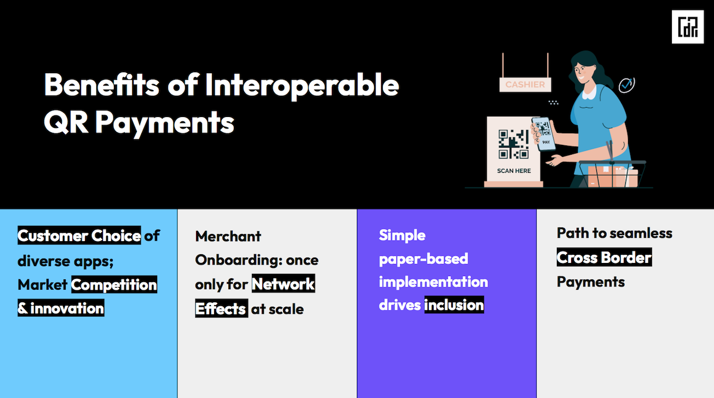
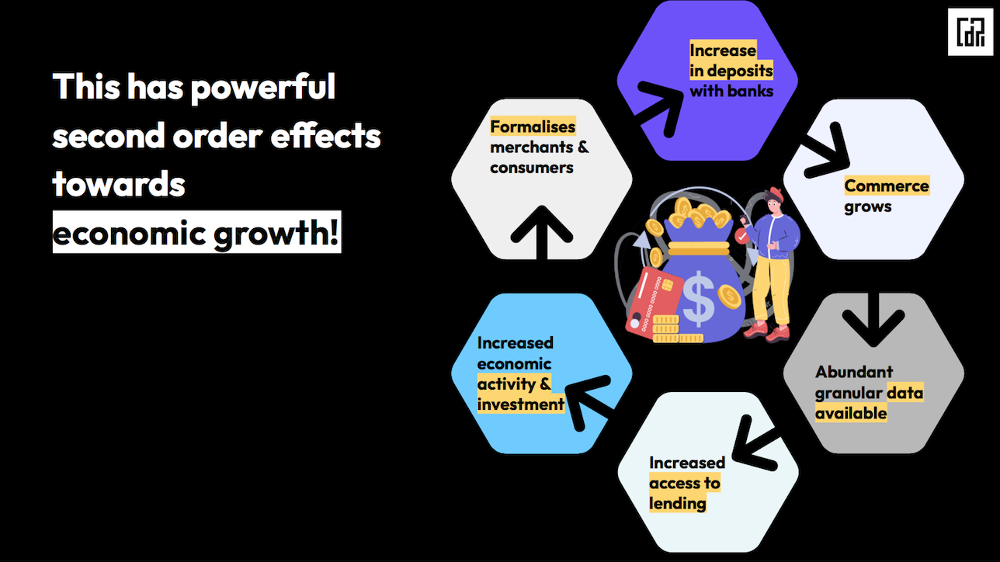

# Interoperable QR Code

**Overview**

Imagine a one-stop feature that your country can build to bridge the digital divide, drive financial inclusion to the last mile, break payments silos, drive e-commerce and GDP, reduce financial crime rates, and spur cross-sectoral innovation - all whilst leveraging existing systems.

Payments made based on an interoperable Quick Response (QR) code standard allow people to make payments to anyone, anytime, and anywhere. Payments can be made in a real-time, and highly secure manner with this digital public infrastructure that allows people to scan a machine readable QR code through any payment application of their choice on their mobile, regardless of which payment app the merchant uses.&#x20;

<div align="left"><figure><figcaption><p>Traditional approach of 'digitisation' breeds exclusion</p></figcaption></figure> <figure><figcaption><p>The DPI approach guarantees inclusion + market participation</p></figcaption></figure></div>

QR codes can be made interoperable if a standard is set out by a central authority, and can allow a user to participate in a single network of banks, financial institutions, mobile money, wallets, or other payment mechanisms on the backend. This can be a simple and powerful addition to existing payments systems.&#x20;

QR Codes can be of two types:&#x20;

1. Static QR Codes: Bill amount has to be manually entered - it is a single code and can be printed as it does not change with each transaction.&#x20;
2. Dynamic QR Codes: Transaction amount is pre-entered by the merchant by connecting it to a PoS terminal.&#x20;

Through Interoperable QR Codes:&#x20;

1. Countries can facilitate seamless payments such as P2P, P2B, P2M and various other entities&#x20;
2. Merchants can automate the reconciliation of orders and payments, as well as generate receipts and notifications by integrating with existing accounting platforms.&#x20;
3. Individuals can set up Recurring payments, Bill Payments etc.,
4. The last mile population can be catered to, and raised to the same level of financial inclusion through digital transformation.
5. The rate of fraud will drop, while increasing privacy, security, transparency and trust across the ecosystem.&#x20;

<div><figure><figcaption><p>First-order effects on the ecosystem</p></figcaption></figure> <figure><figcaption><p>Second-order effects on the country's overall growth</p></figcaption></figure></div>

## P2M Ecosystem Players

1. Merchant
2. Merchant acquiring bank
3. Customer
4. Customer bank
5. Interoperable payment network switch

Additionally, experience layer at merchant and customer can optionally be supported by payment service provider app by fintech ecosystem connected to banks.

## Specifications



**Status:** Draft Version; Request for Comments&#x20;

**Version**: <mark style="color:red;">0.8.2 Draft</mark>

**Date**: 19-Jul-2023

**Authors**: CDPI&#x20;

**Contact**: info@cdpi.dev

**Description**:&#x20;

Interoperable QR code specification to Scan & Pay, Click & Pay and to Deep Link between apps and to enable easy one click and authorise one time or recurring payment.

**Specification:** [link](https://centre-for-dpi.github.io/docs/qr_code.html) | [source](../../technical-specs/payments/src/qr_code.yaml)

**Discussions**:  [link](https://github.com/orgs/centre-for-dpi/discussions)&#x20;




```json
{
  "version": "1.0.0",
  "payee_fa": "joeuser@national-bank",
  "payee_name": "Printing & Stationeries Co",
  "amount": "138.50",
  "amount_split": {
    "sale": "117.37",
    "igst": "21.13"
  },
  "init_mode": "POS",
  "currency": "ZAR",
  "mid": "M-12345",
  "pos_id": "POS-123",
  "expiry": "20230605T101225+5:30",
  "order_id": "2023/123456",
  "ref_url": "https://printing.co/orderId=2023/123456",
  "additional_data": {
    "bill_number": "123",
    "reference_no": "PO123",
    "key1": "value1"
  },
  "sign": ""
}
```




## Deep Linking

QR code content can also be represented in URI representation to enable single QR spec in Deep Linking. Deep Linking enables sharing the scanned QR codes across mobile applications with in a device to easily transfer control from business app to payment apps.

It is recommended to represent the JSON QR code spec in URL encodded format. URL encoding shall ensure to accomodate JSON nested attributes in string represenation to carry in an URI.

```
xxx://pay?%7B%0A%20%20%22version%22%3A%20%221.0.0%22%2C%0A%20%20%22payee_fa%22%3A%20%22joeuser%40national-bank%22%2C%0A%20%20%22payee_name%22%3A%20%22Printing%20%26%20Stationeries%20Co%22%2C%0A%20%20%22amount%22%3A%20%22138.50%22%2C%0A%20%20%22amount_split%22%3A%20%7B%0A%20%20%20%20%22sale%22%3A%20%22117.37%22%2C%0A%20%20%20%20%22igst%22%3A%20%2221.13%22%0A%20%20%7D%2C%0A%20%20%22init_mode%22%3A%20%22POS%22%2C%0A%20%20%22currency%22%3A%20%22ZAR%22%2C%0A%20%20%22mid%22%3A%20%22M-12345%22%2C%0A%20%20%22pos_id%22%3A%20%22POS-123%22%2C%0A%20%20%22expiry%22%3A%20%2220230605T101225%2B5%3A30%22%2C%0A%20%20%22order_id%22%3A%20%222023%2F123456%22%2C%0A%20%20%22ref_url%22%3A%20%22https%3A%2F%2Fprinting.co%2ForderId%3D2023%2F123456%22%2C%0A%20%20%22additional_data%22%3A%20%7B%0A%20%20%20%20%22bill_number%22%3A%20%22123%22%2C%0A%20%20%20%20%22reference_no%22%3A%20%22PO123%22%2C%0A%20%20%20%20%22key1%22%3A%20%22value1%22%0A%20%20%7D%2C%0A%20%20%22sign%22%3A%20%22%22%0A%7D

```

## Stress Testing

Above specification has been stress tested for below use cases. Sample JSONs are provided for easy reference.

<table><thead><tr><th width="73">No</th><th width="199">Scenario</th><th>Remarks</th></tr></thead><tbody><tr><td>1</td><td>Initiation Modes</td><td>Scan &#x26; Pay, Click &#x26; Pay, Deep Linking</td></tr><tr><td>2</td><td>Initiation Locations</td><td>Terminals, POS, Online, ATM</td></tr><tr><td>3</td><td>Static / Dynamic QRs</td><td></td></tr><tr><td>4</td><td>P2M &#x26; P2P use cases</td><td></td></tr><tr><td>5</td><td>Subscripitons / Recurring Payments</td><td>Fixed amount e.g., Rentals, Equity/MF SIPs, EMIs, Subscriptions, etc.,</td></tr><tr><td>6</td><td>Bill Payments</td><td>Varying amount e.g., Utilities</td></tr><tr><td>7</td><td>IPO Payments</td><td></td></tr><tr><td>8</td><td>Refunds</td><td></td></tr><tr><td>9</td><td>Buy Now Pay Later</td><td></td></tr><tr><td>10</td><td>Step Up/Down Payments</td><td></td></tr></tbody></table>

## Technical Considerations

1. Signed QR code content is mandatory to ensure **security** and detect any malicious requests / phishing attacks.
2. &#x20;Scanning of QR codes and verification of **digitally singed** QR code content is the responsibility of the payment apps on customer mobiles.
3. Payment Network provider shall manage the registry of all **acquiring banks** authorised to onboard merchants and offer digitally singed QR codes.&#x20;
4. QR Codes perform well if information is **sparsely packed** for all types of devices displaying and scanning can optimally perform. Where possible, implementers are recommended to use short URLs and **optimise size** of overall QR code. This QR specs ensured to keep the json attribute values short.

## Typical flow

Below is a typical flow to make initiate merchant based QR code based payments:

1. Merchant signs up with acquiring banks to available QR code based payment service
2. Using merchant's banking interface, merchant requests a static QR code
3. Additionally merchant may integrate with POS terminal to generate dynamic QR codes using APIs for each transaction with amount and other customised attributes like description, tax info etc.,
4. Customer using her payment app scans the interoperable QR code
5. Payment app checks signed QR code scanned is non-tampered and is from trusted source. Uses network registry to identify the acquiring banks
6. Customer payment app provides a choice to customer to select linked accounts to pay for the transaction
7. Customer payment app securely collects banking account pin to authorise the payment from the customer
8. Customer payment app initiates the payment on interoperable payments network to pay to the merchant's account
9. Notification of payment status is notified to merchant and customer by the respective banking apps.

## Additional References

1. [Interactive closed-door discussion](https://www.youtube.com/watch?v=tIZGplZjGDI) on Scaling Inclusive Payments through Interoperable QR Codes with central bank officials of 30+ countries and speakers from Brazil, India, Philippines, and Nigeria&#x20;
2. [Presentation Deck](https://docs.google.com/presentation/d/1xeVsXxTwhaW8SjSxHg9HddoprGDpD5sZlVKeWimT0NY/edit?usp=sharing) summarising the need, benefits and specifications of interoperable QR codes in a simple, visually-appealing manner&#x20;
3. QR Code printing specifications <**coming soon>**
4. [The use of quick-response codes in payments](https://fastpayments.worldbank.org/sites/default/files/2021-10/QR_Codes_in_Payments_Final.pdf) Part of World Bank Fast Payments Toolkit Sep 2021

## Attributions

