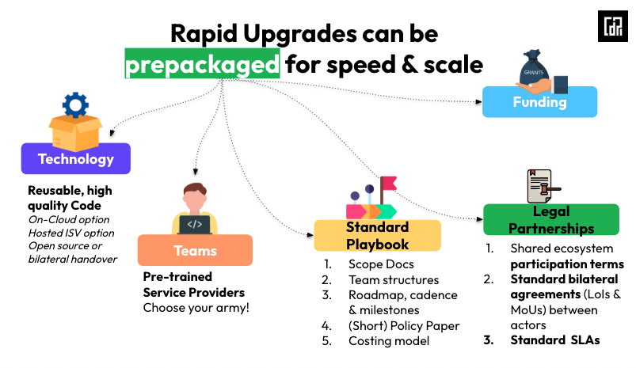

# 🎯 DaaS in a nutshell

DPI as a packaged Solution (DaaS) refers to the rapid deployment of DPI, primarily through [upgrades of existing infrastructure](cohort-1-daas-offerings/), rather than greenfield implementations. This approach often avoids new or complex procurement processes by leveraging existing systems and vendors.

There are multiple operational modules for DaaS:&#x20;

1. <mark style="background-color:purple;">Benefit from Open Source Artefacts and Funded & Pre-Trained Service Providers:</mark> Countries can choose to join the [funded DaaS program](funded-daas-program-overview.md) to receive [pre-packaged offerings](pre-packaged-daas-kits.md) of their chosen product (digital public goods), and pre-trained service providers (trained by the digital public good owner) to support deployment. The program also includes policy frameworks, program management kits, legal templates, and costing models.
2. <mark style="background-color:purple;">Benefit from Open Source Artefacts only:</mark> Countries can also choose to reuse any of the reusable implementation DaaS [artefacts](reusable-daas-artefacts.md) to rapidly upgrade their existing systems to DPI. For example, reusing an eSign module to add authentication on any ID using an existing vendor, at their own cost and according to their own timelines.  &#x20;
3. <mark style="background-color:purple;">Benefit from Pre-Trained Service Provider only:</mark> Countries can also choose to deploy an offering from a private pre-existing vendor who has been trained under the DaaS program by the DPG owner.

DaaS emphasises fast-track deployment pathways that can often work within existing procurement frameworks or vendor relationships, particularly for minimalist DPI blocks that do not require large new procurements. This ensures quicker delivery of benefits to people and institutions.

DaaS differs from traditional pilots or POCs because the infrastructure is built for population-scale from day one using country resources and capacity, and can reach full coverage in a matter of months. This is supported by the fact that DaaS applies only to minimalist layers such as authentication on top of existing ID systems, rather than ID enrolment itself, which even on a best-effort basis would take years to cover the whole population.

Regardless of whether countries choose to join the funded DaaS cohort or independently execute DPI blocks, it can be helpful to [reuse some standardised DPI artefacts](reusable-daas-artefacts.md) that can help expedite the process of execution, regardless of the DPI block chosen, the choice of vendor, or the scale of execution.

<figure><figcaption></figcaption></figure>

<mark style="background-color:purple;">**DaaS will fast track DPI adoption to any ‘hard to reach areas’, applicable beyond the globalisation effort.**</mark>&#x20;

•⁠  ⁠⁠Reusable for sub-national/state level adoption within any large countries, such as state-level registries.

•⁠ Reusable wherever decentralised private adoption of a module is required, such as verifiable credentials.

A presentation on DaaS can be viewed here:



