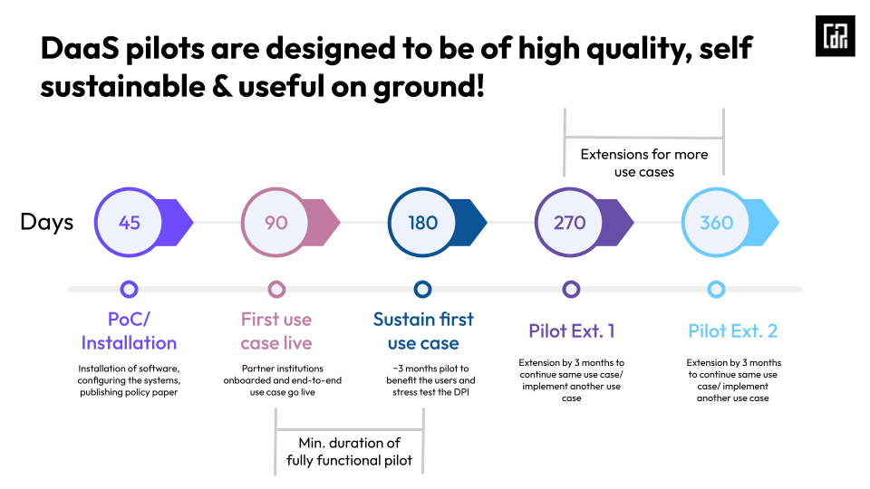

# 📈 Funded DaaS Program overview

The DaaS program is a competitive application process where countries can make the case for why they are best suited to <mark style="background-color:purple;">quickly implement and scale DPI through the DaaS module</mark> in their own countries.&#x20;

### Timelines & Actors in the first wave

The selected countries will be given their <mark style="background-color:purple;">**DaaS packages as well as supplementary funding for DPI rollouts**</mark> by June 2024. The phase one of the DPI roll-out will be launched in 90 days and sustain for another 90 days (making the program duration a total of 180 days) to demonstrate sufficient proof of success. Post the completion of the funded program, the country and DPG can mutually choose to extend it for more time (or another use case), or start the transition to scale.&#x20;

1. The Centre for Digital Public Infrastructure and EkStep Foundation are joint convenors of the program.
2. The first cohort is being executed in partnership with IIITB/EkStep (as open source DPG owners depending on the product).
3. Countries undergo an assessment process to ensure they are ready to execute a time-bound rollout for higher chances of success.&#x20;

<figure><figcaption></figcaption></figure>

### A Final Snapshot: What’s on Offer?&#x20;

1. **DPI Product Packages Available**: Digital authentication, Digital Credentials, ID Account Mapper.
2. **Ecosystem Support Provided**: DaaS package which is provided by DPG providers, certified implementation partners & cloud providers, and Technology Service Providers to implement the DPI.
3. **Funding Sources**: DaaS-based pilot funds from philanthropy, government funders, and other sources to launch DPI.
4. **Timeline to launch**: Countries can reach out to CDPI to be a part of DaaS pilots at info@cdpi.dev. The support for rollout and funding will be released after initial rounds of conversation and country assessment (\~2 months).

A more visual representation of the above playbook is attached below:


