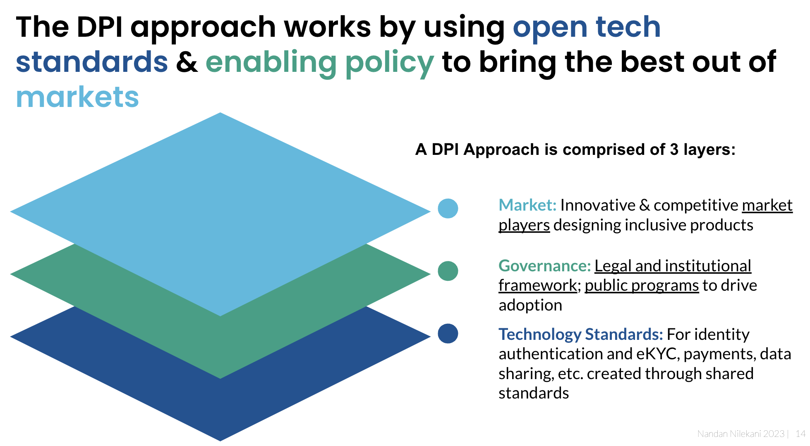

# DPI Architecture Principles

| 
<strong>DPI Architecture Design Principles</strong> 

<strong>(What to aim for)</strong>
                                                                                                                                                                                                                                                                                                                                                                                                                                                                                                                                                                                                                                                                                                                                                                                                                                                                                                                                                                                                                                                                                                                                                                                                                                                                                                                                                                                                                                                                                             | 
<strong>Technical Tools</strong> 

<strong>(How to achieve it)</strong>
                                                                                                                                                                                                                 | 
<strong>Societal Outcomes</strong>

<strong>(Why it Matters)</strong>

 
                                                                                                                                                                                                |
| ------------------------------------------------------------------------------------------------------------------------------------------------------------------------------------------------------------------------------------------------------------------------------------------------------------------------------------------------------------------------------------------------------------------------------------------------------------------------------------------------------------------------------------------------------------------------------------------------------------------------------------------------------------------------------------------------------------------------------------------------------------------------------------------------------------------------------------------------------------------------------------------------------------------------------------------------------------------------------------------------------------------------------------------------------------------------------------------------------------------------------------------------------------------------------------------------------------------------------------------------------------------------------------------------------------------------------------------------------------------------------------------------------------------------------------------------------------------------------------------------------------------------------------------------------------------------------------------------ | --------------------------------------------------------------------------------------------------------------------------------------------------------------------------------------------------------------------------------------------------------------------------------------------------- | ------------------------------------------------------------------------------------------------------------------------------------------------------------------------------------------------------------------------------------------------------------------------------------------- |
| 
1. Interoperability

 

Accelerate network effects to drive innovation and competition with technological specifications, protocols and standards for various functions that enable interoperability across multiple actors. Prevent silos, fragmentation of networks, monopolisation, and walled gardens by design.
                                                                                                                                                                                                                                                                                                                                                                                                                                                                                                                                                                                                                                                                                                                                                                                                                                                                                                                                                                                                                                                                                                                                                                                                                                                         | Published protocols & standards/specifications for the ecosystem to adopt and comply with                                                                                                                                                                                                           | 
Choice of solutions and services for individuals

 

Scale of access and adoption for individuals

 

Competition in markets while remaining interoperable

 

Innovation by market players to drive differentiation of their service
         |
| 
2. Minimalist &#x26; modular building blocks, not full solutions

 

We cannot predict the future, or predict all scenarios to build a full stack, end to end digital solution. Unfortunately, a full solution approach assumes just one solution will fit everyone or just one entity/institution can build for all. 

 

Instead, this principle necessitates technology architects unbundle problems and solutions to core, modular, and minimalist set of interoperable building blocks and open protocols and specifications to connect them. These building blocks should create high trust and low cost for markets. The ecosystem can then combine these building blocks to create many solutions fit for purpose (akin to lego blocks).

 

This also means DPI building is about building less, not more, thus reducing the risk of failure. Sometimes, this simply means providing just open protocols and specifications without any system at all (think TCP-IP/HTTP) or having to build a full end-to-end solution that gets outdated quickly, has much higher cost, and is non-sustainable.  

 

This ensures simplicity of the DPI, low cost/risk of building, ease of scalability/adoption, higher innovation around the DPI, evolvability to address future use cases, and avoids hard-coding and building of costly monolithic full stack solutions. 

 

Maximalism creates complexity, high risk, and low innovation; cannot deal with future advancements; and most importantly drives exclusion.
 | 
Design of minimalist components, protocols/specifications that do NOT form a complete solution, but perform one function well. 

 

This means DPI architects should not overspecify data fields, forms of data, modes of use, types of authentication, etc.

   
 | 
Feasibility &#x26; Success of digital intervention

 

Privacy 

 

Combinatorial innovation

 

User-centric solutions

 

Financial sustainability (lower cost of the DPI)

 

Evolvability  &#x26; Extensibility
 |
| 
3. Enable Diverse Innovation by the ecosystem

 

Allow others (public and private innovators) to build solutions and services using the DPI at scale (akin to highways or the Internet) instead of DPI providers building the entire solution in a monolithic fashion.

 

Enable innovation both by ‘challenger’ market players in the financial ecosystem and by incumbents.

 

Enable diversity of innovation across online and offline, self-service and assisted, and in smartphone/feature phone/ no-phone modes. This is essential to balance inclusion and innovation, thus addressing scale and adaptability/sustainability over time.

 

Private Innovation can be leveraged both in building the DPI and in leveraging the DPI in a wider digital economy to offer solutions

 

Adoption and innovation should be voluntary and demand-led
                                                                                                                                                                                                                                                                                                                                                                                                                                                                                                                                                                                                                                                                | 
Open APIs

Digital signatures (Public Key Infrastructure)

 

Digitally signed QR codes 

 

Machine readability of documents 

 

Reusable SDKs

 

Data &#x26; other Standards

 

Multi-modal access

 
     | 
Inclusion 

 

Scale

 

Choice

 

Resilience

 

User-centric solutions
                                                                                                                                                        |
| 
4. Security &#x26; Privacy by Design

 

Build a ‘Trust no one architecture’ that operates on optimal ignorance - each system should know as little as possible.

 

Ensure high auditability and traceability via digitally signed data and transaction trails.

 

Build and leverage participant registries (individuals, entities, things in future) as independent building blocks to create higher trust and auditability.

 

Adopt verifiable credentials to increase trust within the system and also enable information verifiability.

 

Enable structured, granular, and auditable consent artifacts and frameworks to enable sharing of personal data across systems.
                                                                                                                                                                                                                                                                                                                                                                                                                                                                                                                                                                                                                                                                                                                                                                                                                                      | 
Tokenisation &#x26; Masking

 

Granular electronic consent

 

End to end encryption

 

Digital signatures 

 

Verifiable credentials

 
                                                                                      | 
Trusted usage of the DPI 

 

Cybersecurity 
                                                                                                                                                                                                                            |
| 
5. Decentralisation &#x26; Asynchronicity

 

Avoid centralisation; allow for federated databases/systems where possible that are each reusable &#x26; accessible by the individual (multiple functional identities, modes of payments, sources of data etc.). This prevents creation of honey pots (cybersecurity risk) and over-aggregation of information into unwieldy large central databases (a privacy risk).

 

In today’s world, it is perfectly possible to connect various systems via common protocols and standards and still achieve unification without centralization. 

 

For new protocols and standards, allow asynchronous adoption (participants within the DPI ecosystem can join at different times without all of them having to agree together and join together, reducing the project risk significantly)  based on readiness rather than waiting for universal adoption/agreements at the start.
                                                                                                                                                                                                                                                                                                                                                                                                                                                                                                                                                                                                                      | ”Wrapper” APIs above disparate existing systems rather than new large centralised databases.                                                                                                                                                                                                        | 
Autonomy of Institutions

 

Cybersecurity

 

Individual Privacy

Resilience - avoid overdependence on any one system

  
                                                                                                                 |

**Note**: DPI architecture designed as per the following principles should be supplemented by governance frameworks that are transparent, accountable, and participatory and robust market innovation to drive exponential outcomes.

<figure><figcaption></figcaption></figure>
