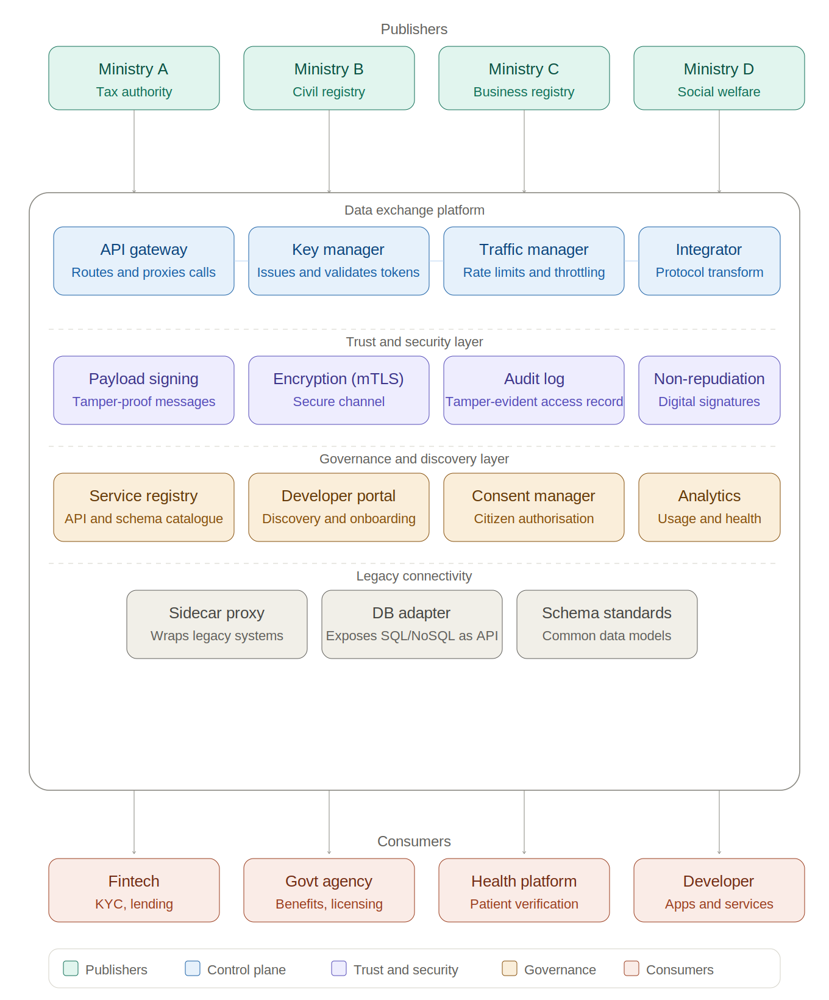

# Data Exchange 101

The components below are not all required from day one — they reflect the full anatomy of a mature exchange, and a country should adopt them progressively as use cases and scale demand.

#### Components

A data exchange platform is typically composed of the following functional layers:

_**Data sharing layer:**_

* **API gateway.** The API gateway is the runtime proxy — the entry point for every call. It intercepts requests, enforces authentication and rate limiting, routes traffic to the correct backend, and returns responses. It is the operational core of the platform.
* **Key manager.** The key manager determines whether a consumer is who they claim to be and whether they are authorised to make a specific call.
* **Traffic manager.** The traffic manager enforces rate limits and throttling across the gateway. It prevents any single consumer from overwhelming the platform and ensures fair allocation of capacity across all participants.
* **Micro integrator.** The micro integrator handles protocol transformation and payload orchestration — translating between REST and SOAP, aggregating responses from multiple backends, and mediating between systems that speak different technical languages. A mature exchange must support both synchronous request-response patterns and event-driven patterns — publish/subscribe, webhooks, and message queues. A civil registration event pushing updates to health, education, and social welfare systems is far more efficient than each consumer polling for changes. Both patterns are necessary.

_**Trust and security layer:**_

* **Payload signing.** Payload signing provides cryptographic proof that message content was not altered in transit and that it came from the holder of a specific signing key. It gives integrity — the content is unchanged — and authenticity — it came from the key holder. It is distinct from encryption: encryption prevents third parties from reading data, while signing lets a verifier attribute the message to its signer. Payload signing is a prerequisite for non-repudiation but not sufficient on its own.
* **Audit log.** The audit log records every data access event — who requested what, when, and what was returned. For regulatory compliance and accountability, this log must be tamper-evident. In centralised platforms, logs are held by the operator. In distributed architectures, logs are held independently by both parties. In event-driven architectures, the log must also capture what events fired, what downstream systems were notified, and whether they acknowledged receipt.
* **Encryption.** Ensures data in transit cannot be read by third parties. In practice this means TLS on every API call between consumer, platform, and backend. A stronger variant, mutual TLS (mTLS), requires both parties to present certificates. Distinct from payload signing — encryption prevents reading; signing prevents tampering.
* **Non-repudiation**. Non-repudiation provides legally binding proof that a specific party sent a specific message and that the recipient received it. It has two components. Non-repudiation of origin requires the signing key to be bound to a vetted identity through a trust infrastructure — a PKI/CA hierarchy, or a decentralised equivalent such as DIDs anchored to a trust registry — and the signature to be trust-timestamped by an independent authority. Non-repudiation of receipt requires a signed acknowledgement from the recipient. Together these ensure neither party can credibly deny what was sent, when, or that it was received.

_**Governance and discovery layer:**_

* **Developer portal.** The developer portal is where consumers discover available APIs, read documentation, test in a sandbox environment, and subscribe to the services they need. It is the outward-facing interface of the platform.
* **Service registry.** The service registry is the machine-readable catalogue of all APIs and data schemas available on the platform. It is foundational to cross-agency interoperability — without a common registry, agencies cannot discover each other's services.
* **Consent manager.** The consent manager handles citizen authorisation for data sharing, capturing, storing and exposing machine-readable consent artefacts (consent receipts) that the gateway can verify at request time before any call involving personal data proceeds. In event-driven exchanges, consent must be verified at the point of subscription.
* **Analytics.** Analytics provides real-time visibility into platform health, usage patterns, and per-consumer breakdowns.

_**Legacy connectivity layer:**_ Legacy connectivity components — sidecar proxies and database adapters — allow systems that were never designed to share data to be exposed as modern APIs without replacing the underlying infrastructure.

Exhibit 1: Components of a data exchange platform (centralised model)

#### A note on X-Road and distributed architectures

The component model above reflects a centralised architecture — the model followed by API Setu, APEX, and UGHub. X-Road, Estonia's national data exchange layer, follows a different topology but retains the same underlying functions.

In X-Road, there is no central gateway. Instead, each participating organisation operates a ‘Security Server’ — a local node that handles routing, encryption, payload signing, and audit logging on that organisation's behalf. The functions do not disappear; they are redistributed to the edge.

What remains central in X-Road is narrow: a Central Server that distributes the global configuration — the trust anchors, the list of approved external Certification Authorities (CAs) and Timestamping Authorities (TSAs), and the registry of members and their Security Servers. The CAs that issue participant certificates and the TSAs that timestamp messages are external trust services, not the Central Server itself. This is what makes the network trusted without requiring a central data broker.
